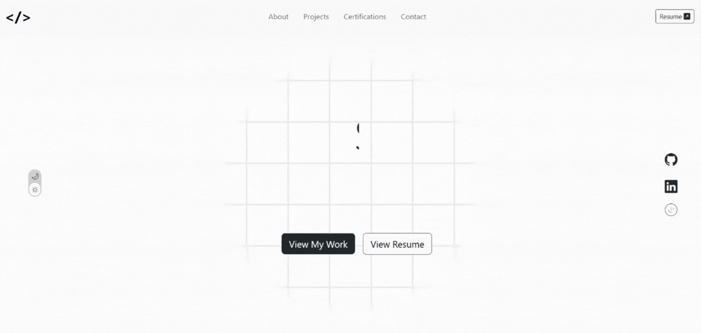

# Personal Portfolio site

## Table of contents

- [About](#about)
  - [Links](#links)
  - [Screenshots](#screenshots)
  - [Overview](#overview)
  - [UI/UX Decisions](#uiux-decisions)
  - [Built with](#built-with)
- [Author](#author)

## About

### Links

Live Site: [https://sruthi-nair166.github.io/portfolio/](https://sruthi-nair166.github.io/portfolio/)

### Screenshots

### Overview

This project is a personal portfolio website designed to showcase selected frontend projects and provide an overview of my skills and approach to building user interfaces. It includes an introduction section, project highlights, and an about section outlining my background and focus areas, as well as a skills and certifications section to highlight my knowledge in various frontend technologies.

To enhance user experience, I added scroll-based animations, with elements sliding or fading into view as users scroll. All animations were implemented using CSS keyframes combined with view() for scroll-triggered effects, keeping the interactions smooth, subtle, and lightweight.

The site is fully responsive and structured to make it easy for visitors to browse projects, understand my work at a glance, and navigate across different screen sizes.

### UI/UX Decisions

- Implemented a light and dark mode toggle to improve accessibility and allow users to choose their preferred viewing experience.

- Used soft, subtle animations throughout the page to add visual interest without distracting from content, keeping the overall experience calm and smooth.

- Added a typing animation in the hero section to introduce my name, followed by faded-in role and description to establish a clear visual flow.

- Applied scroll-based animations where key elements slide or fade into view, helping guide attention as users move through the page.

- Designed the skills section as a horizontal scrolling belt, allowing it to be both scroll-driven and manually scrollable to avoid vertical clutter.

- Used a minimal black-and-white color palette to keep the design neat and focused.

- Structured content into clearly defined sections to maintain a predictable layout and easy navigation.

### Built With

- HTML
- CSS
- Bootstrap
- JavaScript

## Author

- LinkedIn - [Sruthi V Nair](https://www.linkedin.com/in/sruthi-v-nair-5b5a09191/)
- Github - [Sruthi V Nair](https://github.com/sruthi-nair166)
